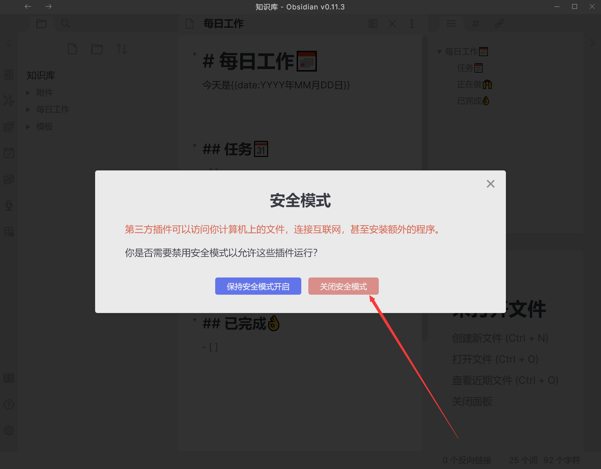

# Obsidian-Vault-Template
上手即用Obsidian知识库模板

>  Ready-to-use Obsidian Vault Template.

## 使用方法

- 安装[Obsidian](https://obsidian.md/)
- Clone仓库到本地，把`知识库`文件夹放到合适的位置，如icloud中
- 打开`知识库`，首次打开会提示安全模式，为了使用第三方插件，点击关闭安全模式
- 打开`设置-第三方插件`，打开已安装的第三方插件，`Citations`不用勾选，不用zotero的可以直接删掉
- 点击左侧边栏的`管理工作区布局`，加载默认布局

## 每日工作使用方法

- 不要修改日记插件的命名格式
- 每次从日历处点击新建日记（每日工作）
- 任务标签下的所有未完成任务会自动转移到新建每日工作中
- 新建后可以用左侧边栏按钮快速打开
- 任务标签放置所有任务，`正在做`标签下的任务从`任务`中复制过来
- 模板可自行修改